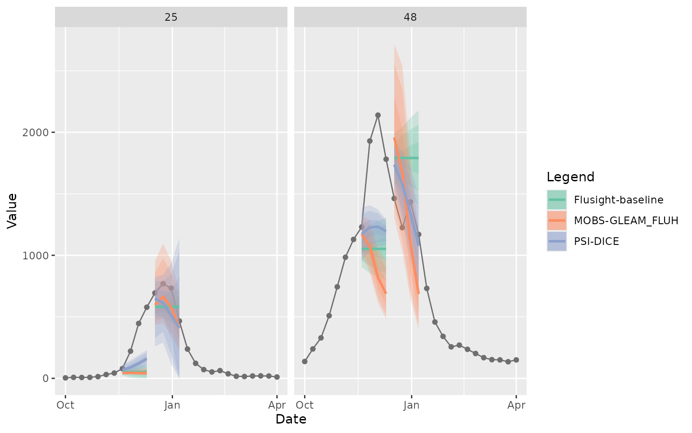
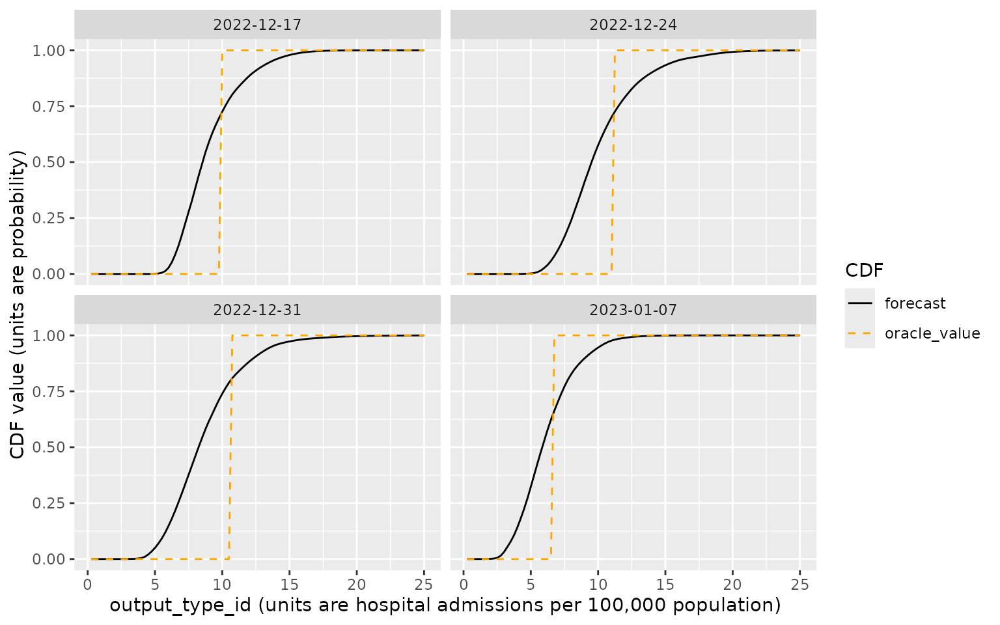
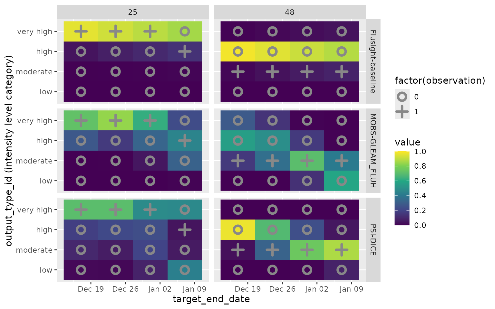
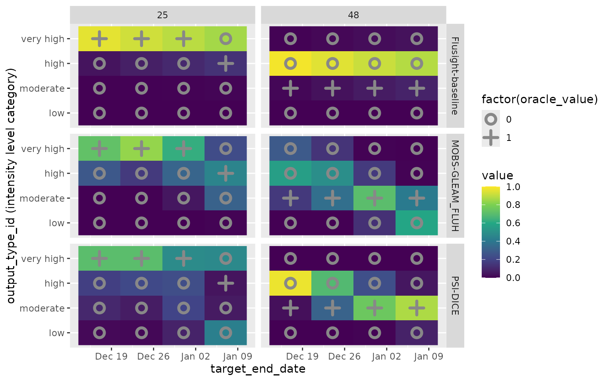

# Example forecast hub data

``` r
library(hubExamples)
library(hubVis)
library(dplyr)
#> 
#> Attaching package: 'dplyr'
#> The following objects are masked from 'package:stats':
#> 
#>     filter, lag
#> The following objects are masked from 'package:base':
#> 
#>     intersect, setdiff, setequal, union
library(ggplot2)
```

## Overview

The `hubExamples` package provides three data sets that contain example
model output and target data for an example forecast hub:
`forecast_outputs`, `forecast_target_ts`, and `forecast_oracle_output`.
These forecasts and target data are a subset of the model outputs and
target data that are provided in the
[example-complex-forecast-hub](https://github.com/hubverse-org/example-complex-forecast-hub).
These data were in turn derived from forecast submissions and target
data for the [FluSight Forecast
Hub](https://github.com/cdcepi/Flusight-forecast-data) for the 2022/23
season.

We begin with a high level overview of these data objects and then we
describe the different forecast targets in more detail.

### Example forecast output data

The example forecasts provided in `forecast_outputs` are derived from
forecasts that were submitted to the FluSight hub from three models:
`Flusight-baseline`, `MOBS-GLEAM_FLUH`, and `PSI-DICE`. The original
forecasts submitted to the hub were in quantile format, but we have
modified those submissions to provide examples of additional model
output types and targets. The predictions for these other output types
should be viewed only as illustrations of the data formats, not as real
examples of forecasts. We will describe the methods used for creating
other forecast output types below.

The snippet below shows the format of the `forecast_outputs` (note: here
and throughout the document, you may need to scroll to the right within
displays of code output to see all data frame columns).

``` r
head(forecast_outputs)
#> # A tibble: 6 × 9
#>   model_id          reference_date target          horizon location target_end_date output_type output_type_id value
#>   <chr>             <date>         <chr>             <int> <chr>    <date>          <chr>       <chr>          <dbl>
#> 1 Flusight-baseline 2022-11-19     wk inc flu hosp       0 25       2022-11-19      quantile    0.05              22
#> 2 Flusight-baseline 2022-11-19     wk inc flu hosp       0 25       2022-11-19      quantile    0.1               31
#> 3 Flusight-baseline 2022-11-19     wk inc flu hosp       0 25       2022-11-19      quantile    0.25              45
#> 4 Flusight-baseline 2022-11-19     wk inc flu hosp       0 25       2022-11-19      quantile    0.5               51
#> 5 Flusight-baseline 2022-11-19     wk inc flu hosp       0 25       2022-11-19      quantile    0.75              57
#> 6 Flusight-baseline 2022-11-19     wk inc flu hosp       0 25       2022-11-19      quantile    0.9               71
```

This is a data frame with four groups of columns (see the [hubverse
documentation](https://docs.hubverse.io/en/latest/user-guide/model-output.html)
for more information about these data formats):

1.  The `model_id` identifies the model that produced the predictions.
2.  Together, the `location`, `reference_date`, `horizon`,
    `target_end_date`, and `target` columns are referred to as “task id
    variables” because they serve to identify a prediction task:
    - The `location` column contains a FIPS code identifying the
      location being predicted.
    - The `reference_date` is a date in ISO format that gives the
      Saturday ending the week the predictions were generated.
    - The `horizon` gives the difference between the `reference_date`
      and the target date of the forecasts (`target_end_date`, see next
      item) in units of weeks. Informally, this describes “how far
      ahead” the predictions are targeting.
    - The `target_end_date` is a date in ISO format that gives the
      Saturday ending the week being predicted. For example, if the
      `target_end_date` is `"2022-12-17"`, predictions are for a
      quantity relating to influenza activity in the week from Sunday,
      December 11, 2022 through Saturday, December 17, 2022.
    - The `target` describes the target quantity for the prediction. In
      the above example, the `target` of `"wk flu hosp rate"` is the
      weekly rate of hospital admissions per 100,000 population. The
      targets included in this example will be described in other
      sections below.
3.  The `output_type` and `output_type_id` columns provide metadata
    about the model predictions.
    - The `output_type` specifies the representation of the predictive
      distribution.
    - The `output_type_id` gives additional identifying information
      about the predictions; the information in this column is specific
      to the `output_type`.
4.  The `value` column contains the value of the model’s prediction.

The original hub submissions contained predictions for many locations
and dates, and quantile forecasts were provided at 23 different quantile
levels ranging from 0.01 to 0.99. To make the example data more
manageable, the `forecast_outputs` object contains a subset of these
outputs for two locations (Massachusetts, FIPS code `"25"`, and Texas,
FIPS code `"48"`) and two reference dates (2022-11-19 and 2022-12-17).
Additionally, for the quantile forecasts we have subset to seven
quantile levels: 0.05, 0.1, 0.25, 0.5, 0.75, 0.9, and 0.95.

The task id variables used and values of those variables are specific to
each modeling hub. For example, a hub collecting predictions for
locations other than US states would use a different location identifier
than FIPS codes, and a hub might introduce additional task id variables
such as an identifier of age group or disease variant depending on the
goals of the hub. See the hubverse documentation for further information
about [task id
variables](https://docs.hubverse.io/en/latest/user-guide/tasks.html#task-id-variables).

### Example forecast target time series data

All predictions are for targets that are based on influenza hospital
admissions as reported in the US National Healthcare Safety Network
(NHSN). The `forecast_target_ts` object contains the observed values of
these hospital admissions in a time series format:

``` r
head(forecast_target_ts)
#> # A tibble: 6 × 4
#>   target_end_date target          location observation
#>   <date>          <chr>           <chr>          <dbl>
#> 1 2020-01-11      wk inc flu hosp 01                 0
#> 2 2020-01-11      wk inc flu hosp 15                 0
#> 3 2020-01-11      wk inc flu hosp 18                 0
#> 4 2020-01-11      wk inc flu hosp 27                 0
#> 5 2020-01-11      wk inc flu hosp 30                 0
#> 6 2020-01-11      wk inc flu hosp 37                 0
tail(forecast_target_ts)
#> # A tibble: 6 × 4
#>   target_end_date target           location observation
#>   <date>          <chr>            <chr>          <dbl>
#> 1 2023-11-11      wk flu hosp rate 51             1.03 
#> 2 2023-11-11      wk flu hosp rate 50             0.464
#> 3 2023-11-11      wk flu hosp rate 53             0.259
#> 4 2023-11-11      wk flu hosp rate 55             0.323
#> 5 2023-11-11      wk flu hosp rate 54             0.676
#> 6 2023-11-11      wk flu hosp rate 56             1.21
```

See the hubverse documentation for further information about [time
series target
data](https://docs.hubverse.io/en/latest/user-guide/target-data.html#time-series).

### Example forecast oracle output

The `forecast_oracle_output` data is derived from the
`forecast_target_ts` data, and it represents predictions that would have
been generated by an “oracle model” that knew the observed data in
advance. The format of the oracle output data is similar to the format
of the `forecast_outputs`:

``` r
head(forecast_oracle_output)
#> # A tibble: 6 × 6
#>   location target_end_date target          output_type output_type_id oracle_value
#>   <chr>    <date>          <chr>           <chr>       <chr>                 <dbl>
#> 1 US       2022-10-22      wk inc flu hosp quantile    NA                     2380
#> 2 01       2022-10-22      wk inc flu hosp quantile    NA                      141
#> 3 02       2022-10-22      wk inc flu hosp quantile    NA                        3
#> 4 04       2022-10-22      wk inc flu hosp quantile    NA                       22
#> 5 05       2022-10-22      wk inc flu hosp quantile    NA                       50
#> 6 06       2022-10-22      wk inc flu hosp quantile    NA                      124
```

This data frame has a subset of the columns in the `forecast_outputs`
that is sufficient to identify the observed value corresponding to each
prediction, including the `location`, `target_end_date`, `target`,
`output_type`, and `output_type_id`, along with the predictions from the
oracle model, recorded in the `oracle_value` column. Note that the
`reference_date` and `horizon` columns are not needed in this data
frame, since the `target_end_date` is sufficient to align observations
with predictions. See the hubverse documentation for further information
about [oracle output
data](https://docs.hubverse.io/en/latest/user-guide/target-data.html#oracle-output).

## Further detail on the forecast targets

The example forecast data contains the following combinations of
`target` and `output_type`:

``` r
forecast_outputs |>
  distinct(target, output_type) |>
  arrange(target, output_type)
#> # A tibble: 6 × 2
#>   target                    output_type
#>   <chr>                     <chr>      
#> 1 wk flu hosp rate          cdf        
#> 2 wk flu hosp rate category pmf        
#> 3 wk inc flu hosp           mean       
#> 4 wk inc flu hosp           median     
#> 5 wk inc flu hosp           quantile   
#> 6 wk inc flu hosp           sample
```

We will describe each of these targets in the following sections.

### The `wk inc flu hosp` target

The `wk inc flu hosp` target represents weekly new hospital admissions
with a confirmed influenza diagnosis. We have predictions of this target
with four output types: `mean`, `median`, `quantile` and `sample`. Note
that the quantile predictions were contributed directly by modelers to
the FluSight hub, and median predictions correspond exactly to the
quantile predictions at probability level 0.5. We have obtained sample
predictions from the quantile forecasts using the [distfromq
package](https://github.com/reichlab/distfromq) by estimating the full
quantile function from the submitted quantile predictions for each
individual location and target date, drawing samples from those marginal
distributions using the probability integral transform method, and using
a copula corresponding to a discrete-time AR(0.9) Gaussian process to
induce dependence across sequential horizons. Mean predictions are
obtained as the mean of samples drawn for each location and target date
combination.

The following plot shows the quantile and median predictions along with
the observed hospital admission counts for Massachusetts and Texas.

``` r
plot_step_ahead_model_output(
  model_out_tbl = forecast_outputs |>
    filter(output_type %in% c("quantile", "median")),
  target_data = forecast_target_ts |>
    filter(location %in% c("25", "48"),
           target_end_date >= "2022-10-01", target_end_date <= "2023-04-01",
           target == "wk inc flu hosp"),
  use_median_as_point = TRUE,
  x_col_name = "target_end_date",
  x_target_col_name = "target_end_date",
  intervals = c(0.5, 0.8, 0.9),
  facet = "location",
  group = "reference_date",
  interactive = FALSE
)
#> Warning: ! `output_type_id` column must be a numeric. Converting to numeric.
```



The following plot shows the target data and predictive samples for just
predictions for Massachusetts with reference date December 17, 2022
generated by the “MOBS-GLEAM_FLUH” model.

``` r
ggplot() +
  geom_line(
    data = forecast_target_ts |>
      filter(location == "25",
             target_end_date >= "2022-10-01", target_end_date <= "2023-04-01",
             target == "wk inc flu hosp"),
    mapping = aes(x = target_end_date, y = observation)
  ) +
  geom_line(
    data = forecast_outputs |>
      filter(
        location == "25",
        model_id == "MOBS-GLEAM_FLUH",
        reference_date == "2022-12-17",
        output_type == "sample"
      ),
    mapping = aes(x = target_end_date, y = value, group = output_type_id),
    color = "blue",
    alpha = 0.3
  ) +
  theme_bw()
```


For purposes of evaluating predictions, it can be helpful to join the
observed target values, contained in `forecast_oracle_output`, into the
data frame of forecast outputs. This enables direct comparison of
predictions and observations. We illustrate this here, omitting some
columns from the display for convenience:

``` r
forecast_outputs |>
  filter(target == "wk inc flu hosp") |>
  left_join(forecast_oracle_output) |>
  select(-model_id, -reference_date, -horizon)
#> Joining with `by = join_by(target, location, target_end_date, output_type, output_type_id)`
#> # A tibble: 5,232 × 7
#>    target          location target_end_date output_type output_type_id value oracle_value
#>    <chr>           <chr>    <date>          <chr>       <chr>          <dbl>        <dbl>
#>  1 wk inc flu hosp 25       2022-11-19      quantile    0.05              22           NA
#>  2 wk inc flu hosp 25       2022-11-19      quantile    0.1               31           NA
#>  3 wk inc flu hosp 25       2022-11-19      quantile    0.25              45           NA
#>  4 wk inc flu hosp 25       2022-11-19      quantile    0.5               51           NA
#>  5 wk inc flu hosp 25       2022-11-19      quantile    0.75              57           NA
#>  6 wk inc flu hosp 25       2022-11-19      quantile    0.9               71           NA
#>  7 wk inc flu hosp 25       2022-11-19      quantile    0.95              80           NA
#>  8 wk inc flu hosp 25       2022-11-26      quantile    0.05               5           NA
#>  9 wk inc flu hosp 25       2022-11-26      quantile    0.1               21           NA
#> 10 wk inc flu hosp 25       2022-11-26      quantile    0.25              38           NA
#> # ℹ 5,222 more rows
```

### The `wk flu hosp rate` target

The `wk flu hosp rate` target represents the rate of weekly confirmed
influenza hospital admissions per 100,000 population. Note that this
target was not included in the FluSight hub; we have introduced it here
for illustrative purposes. We have used population values of 6,978,662
for Massachusetts and 29,914,599 for Texas. These population values are
sourced from the [auxiliary data
file](https://github.com/cdcepi/FluSight-forecast-hub/blob/main/auxiliary-data/locations.csv)
provided by the FluSight hub, which are also reproduced in the
[example-complex-forecast-hub](https://github.com/hubverse-org/example-complex-forecast-hub)
repository.

For this target, we created cumulative distribution function (CDF)
predictions with evenly spaced CDF evaluation points ranging from 0.25
to 25 in increments of 0.25 hospitalizations per 100,000 population:

``` r
forecast_outputs |>
  filter(target == "wk flu hosp rate") |>
  select(-model_id, -reference_date, -horizon) |>
  arrange(location, target_end_date) |>
  head()
#> # A tibble: 6 × 6
#>   target           location target_end_date output_type output_type_id  value
#>   <chr>            <chr>    <date>          <chr>       <chr>           <dbl>
#> 1 wk flu hosp rate 25       2022-11-19      cdf         0.25           0.0409
#> 2 wk flu hosp rate 25       2022-11-19      cdf         0.5            0.131 
#> 3 wk flu hosp rate 25       2022-11-19      cdf         0.75           0.568 
#> 4 wk flu hosp rate 25       2022-11-19      cdf         1              0.891 
#> 5 wk flu hosp rate 25       2022-11-19      cdf         1.25           0.965 
#> 6 wk flu hosp rate 25       2022-11-19      cdf         1.5            0.985
```

For the CDF `output_type`, the `output_type_id` contains the value at
which the predictive CDF was evaluated, and the `value` contains the
predicted probability that the target is less than or equal to that
evaluation point. In the above example, the `value` in the row with
`output_type_id` equal to 1.5 contains the model’s estimated probability
that the rate of hospital admissions in Texas the week of December 17,
2022 would be less than or equal to 1.5 admissions per 100,000
population. Again, these CDF values were estimated from the original
quantile forecasts using the methods in the `distfromq` package.

The following plot illustrates the predictive CDFs produced by the
`MOBS-GLEAM_FLUH` model for Massachusetts on the reference date
2022-12-17, with each `target_end_date` shown in a separate facet. Also
shown in orange is a CDF representing the observation for this target,
which was between 9.75 and 10 hospitalizations per 100,000 population.
This CDF corresponds to a point mass at the observed value, with a value
of 0 below the observation and a value of 1 above the observation.

``` r
# Subset the forecasts and oracle values to those that we will plot
forecasts_to_plot <- forecast_outputs |>
  filter(
    model_id == "MOBS-GLEAM_FLUH",
    target == "wk flu hosp rate",
    location == "25",
    reference_date == "2022-12-17"
  ) |>
  mutate(output_type_id = as.numeric(output_type_id))
head(forecasts_to_plot)
#> # A tibble: 6 × 9
#>   model_id        reference_date target           horizon location target_end_date output_type output_type_id    value
#>   <chr>           <date>         <chr>              <int> <chr>    <date>          <chr>                <dbl>    <dbl>
#> 1 MOBS-GLEAM_FLUH 2022-12-17     wk flu hosp rate       0 25       2022-12-17      cdf                   0.25 8.52e-21
#> 2 MOBS-GLEAM_FLUH 2022-12-17     wk flu hosp rate       0 25       2022-12-17      cdf                   0.5  1.63e-19
#> 3 MOBS-GLEAM_FLUH 2022-12-17     wk flu hosp rate       0 25       2022-12-17      cdf                   0.75 2.80e-18
#> 4 MOBS-GLEAM_FLUH 2022-12-17     wk flu hosp rate       0 25       2022-12-17      cdf                   1    4.37e-17
#> 5 MOBS-GLEAM_FLUH 2022-12-17     wk flu hosp rate       0 25       2022-12-17      cdf                   1.25 6.17e-16
#> 6 MOBS-GLEAM_FLUH 2022-12-17     wk flu hosp rate       0 25       2022-12-17      cdf                   1.5  7.87e-15

oracle_outputs_to_plot <- forecast_oracle_output |>
  filter(
    target == "wk flu hosp rate",
    location == "25",
    target_end_date %in% forecasts_to_plot$target_end_date
  ) |>
  mutate(output_type_id = as.numeric(output_type_id))
head(oracle_outputs_to_plot)
#> # A tibble: 6 × 6
#>   location target_end_date target           output_type output_type_id oracle_value
#>   <chr>    <date>          <chr>            <chr>                <dbl>        <dbl>
#> 1 25       2022-12-17      wk flu hosp rate cdf                   0.25            0
#> 2 25       2022-12-17      wk flu hosp rate cdf                   0.5             0
#> 3 25       2022-12-17      wk flu hosp rate cdf                   0.75            0
#> 4 25       2022-12-17      wk flu hosp rate cdf                   1               0
#> 5 25       2022-12-17      wk flu hosp rate cdf                   1.25            0
#> 6 25       2022-12-17      wk flu hosp rate cdf                   1.5             0

# We illustrate that the cdf values recorded in forecast_oracle_output
# correspond to a point mass at the observed hospitalization rate.
first_one_ind <- min(which(oracle_outputs_to_plot$oracle_value == 1))
oracle_outputs_to_plot[(first_one_ind - 2):(first_one_ind + 2), ]
#> # A tibble: 5 × 6
#>   location target_end_date target           output_type output_type_id oracle_value
#>   <chr>    <date>          <chr>            <chr>                <dbl>        <dbl>
#> 1 25       2022-12-17      wk flu hosp rate cdf                   9.5             0
#> 2 25       2022-12-17      wk flu hosp rate cdf                   9.75            0
#> 3 25       2022-12-17      wk flu hosp rate cdf                  10               1
#> 4 25       2022-12-17      wk flu hosp rate cdf                  10.2             1
#> 5 25       2022-12-17      wk flu hosp rate cdf                  10.5             1

# Make the plot
ggplot() +
  geom_line(
    mapping = aes(x = output_type_id, y = value,
                  color = "forecast", linetype = "forecast"),
    data = forecasts_to_plot
  ) +
  geom_line(
    mapping = aes(x = output_type_id, y = oracle_value,
                  color = "oracle_value", linetype = "oracle_value"),
    data = oracle_outputs_to_plot,
  ) +
  scale_color_manual(
    "CDF",
    values = c("black", "orange")
  ) +
  scale_linetype_manual(
    "CDF",
    values = c(1, 2)
  ) +
  facet_wrap(vars(target_end_date)) +
  xlab("output_type_id (units are hospital admissions per 100,000 population)") +
  ylab("CDF value (units are probability)")
```



### The `wk flu hosp rate category` target

The “wk flu hosp rate category” target represents a categorical
intensity level of influenza activity, defined as “low” (hospital
admissions rate per 100,000 $\leq$ 2.5), “moderate” (2.5 \< admissions
rate $\leq$ 5), “high” (5 \< admissions rate $\leq$ 7.5), or “very high”
(7.5 \< admissions rate). The `forecast_outputs` object has example
forecasts for this target in a PMF format, with a probability assigned
to each intensity category. Again, forecasts of this target were not
collected by the FluSight hub; we have derived predictions from the
submitted quantile forecasts using the `distfromq` package. For context,
the following plot displays the observed data for the 2022/23 season on
the scale of hospital admissions per 100,000 population, with the
boundaries of the intensity categories denoted with horizontal lines:

``` r
# a data frame containing location FIPS codes and population values
# in units of 100,000 people
population_values <- data.frame(
  location = c("25", "48"),
  population_100k = c(6978662, 29914599) / 100000
)

# compute observed hospital admission rates for the 2022/23 season
observed_rates <- forecast_target_ts |>
  filter(location %in% c("25", "48"),
         target_end_date >= "2022-10-01", target_end_date <= "2023-04-01",
         target == "wk inc flu hosp") |>
  left_join(population_values) |>
  mutate(rate = observation / population_100k)
#> Joining with `by = join_by(location)`

# plot along with intensity thresholds
ggplot() +
  geom_line(
    mapping = aes(x = target_end_date, y = rate),
    data = observed_rates
  ) +
  geom_hline(
    mapping = aes(yintercept = y),
    linetype = 2,
    data = data.frame(y = c(2.5, 5, 7.5))
  ) +
  facet_wrap(vars(location))
```



Here is a plot showing the predictive distributions for these targets
from the three included models. Color indicates the predicted
probability for each intensity category. The observed category is
indicated with a `+` in the plot, while unobserved categories are
indicated with an `o`. Here, the PMF value recorded in
`forecast_oracle_output` corresponds to a point mass at the observed
category, with a value of 1 for the observed category and a value of 0
for the other categories.

``` r
# extract a subset of forecasts to plot and
# set the output_type_id to be an ordered factor
forecasts_to_plot <- forecast_outputs |>
  filter(
    target == "wk flu hosp rate category",
    reference_date == "2022-12-17"
  ) |>
  mutate(
    output_type_id = factor(output_type_id,
                            levels = c("low", "moderate", "high", "very high"),
                            ordered = TRUE)
  )
forecasts_to_plot |>
  select(-model_id, -reference_date, -horizon) |>
  head()
#> # A tibble: 6 × 6
#>   target                    location target_end_date output_type output_type_id      value
#>   <chr>                     <chr>    <date>          <chr>       <ord>               <dbl>
#> 1 wk flu hosp rate category 25       2022-12-17      pmf         low            0.0000180 
#> 2 wk flu hosp rate category 25       2022-12-17      pmf         moderate       0.00157   
#> 3 wk flu hosp rate category 25       2022-12-17      pmf         high           0.0397    
#> 4 wk flu hosp rate category 25       2022-12-17      pmf         very high      0.959     
#> 5 wk flu hosp rate category 25       2022-12-24      pmf         low            0.00000970
#> 6 wk flu hosp rate category 25       2022-12-24      pmf         moderate       0.00294

# extract the corresponding oracle values
oracle_outputs_to_plot <- forecast_oracle_output |>
  filter(
    location %in% c("25", "48"),
    target == "wk flu hosp rate category",
    target_end_date %in% forecasts_to_plot$target_end_date
  ) |>
  mutate(
    output_type_id = factor(output_type_id,
                            levels = c("low", "moderate", "high", "very high"),
                            ordered = TRUE)
  )
oracle_outputs_to_plot |>
  head()
#> # A tibble: 6 × 6
#>   location target_end_date target                    output_type output_type_id oracle_value
#>   <chr>    <date>          <chr>                     <chr>       <ord>                 <dbl>
#> 1 25       2022-12-17      wk flu hosp rate category pmf         low                       0
#> 2 25       2022-12-17      wk flu hosp rate category pmf         moderate                  0
#> 3 25       2022-12-17      wk flu hosp rate category pmf         high                      0
#> 4 25       2022-12-17      wk flu hosp rate category pmf         very high                 1
#> 5 48       2022-12-17      wk flu hosp rate category pmf         low                       0
#> 6 48       2022-12-17      wk flu hosp rate category pmf         moderate                  1

# plot the predictions and oracle values
ggplot() +
  geom_raster(
    mapping = aes(x = target_end_date, y = output_type_id, fill = value),
    data = forecasts_to_plot
  ) +
  scale_fill_viridis_c(
    breaks = seq(from = 0, to = 1, by = 0.2),
    limits = c(0, 1)
  ) +
  geom_point(
    mapping = aes(x = target_end_date, y = output_type_id,
                  shape = factor(oracle_value)),
    color = "#888888",
    size = 3, stroke = 2,
    data = oracle_outputs_to_plot,
  ) +
  scale_shape_manual(
    values = c(1, 3),
    breaks = c(0, 1)
  ) +
  facet_grid(rows = vars(model_id), cols = vars(location)) +
  ylab("output_type_id (intensity level category)")
```


